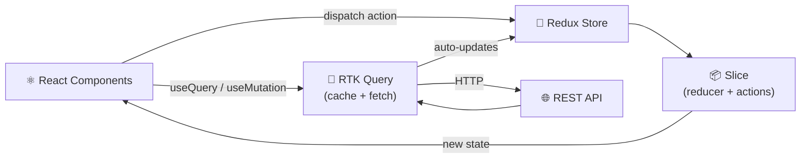

# React + Redux Example

<p align="center">
  
  
  
  
  
</p>

A clean **React + Redux Toolkit example** demonstrating modern state management patterns: slices, async thunks, selectors, and RTK Query. Built with TypeScript and Vite.

---

## 🏗️ State Flow



---

## 🚀 Quick Start

```bash
npm install
npm run dev
```

Open `http://localhost:5173`

---

## 📁 Structure

```
src/
├── app/
│   └── store.ts              # Redux store config
├── features/
│   ├── counter/
│   │   ├── counterSlice.ts   # Slice with reducers + actions
│   │   └── Counter.tsx       # Connected component
│   └── posts/
│       ├── postsSlice.ts     # Async thunk example
│       └── PostsList.tsx
└── services/
    └── api.ts                # RTK Query API definition
```

---

## 🧩 Key Patterns

### Slice
```ts
const counterSlice = createSlice({
  name: 'counter',
  initialState: { value: 0 },
  reducers: {
    increment: (state) => { state.value += 1 },
    decrement: (state) => { state.value -= 1 },
  },
});
```

### Async Thunk
```ts
export const fetchPosts = createAsyncThunk('posts/fetch', async () => {
  const res = await fetch('/api/posts');
  return res.json();
});
```

### RTK Query
```ts
const api = createApi({
  baseQuery: fetchBaseQuery({ baseUrl: '/api' }),
  endpoints: (build) => ({
    getPosts: build.query<Post[], void>({ query: () => '/posts' }),
  }),
});
```

---

## 📄 License

MIT
